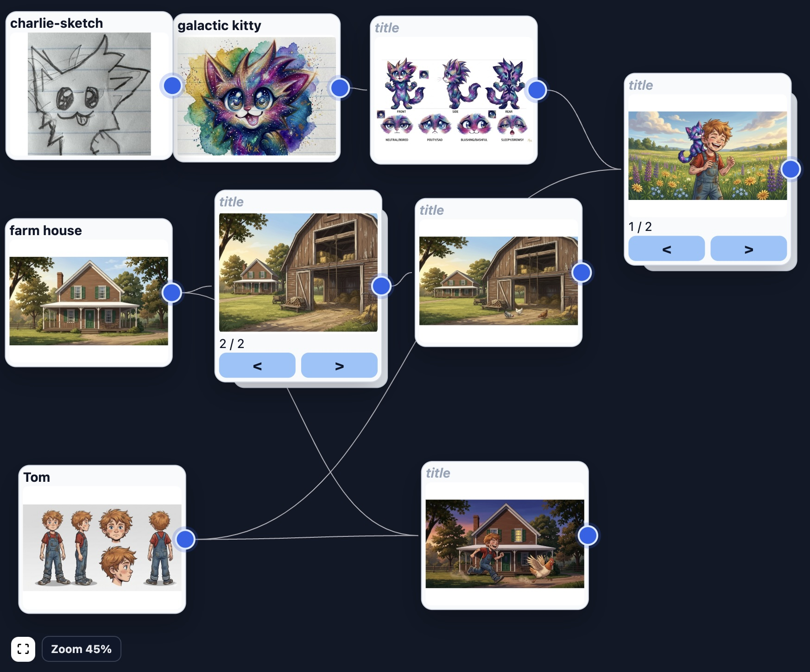

# Comic Canvas

Build comic books with AI assistance: an image-generation canvas with
parent → child lineage, a story/panel layout editor with booklet PDF export,
and narrow **pi agent** tasks that extract characters, locations, and concept
art from a source book.



See [ARCHITECTURE.md](ARCHITECTURE.md) for the system layout and [AGENTS.md](AGENTS.md)
for project conventions.

## Install (macOS arm64, Linux x86_64)

```bash
curl -fsSL https://raw.githubusercontent.com/PlebeiusGaragicus/picture-web/main/install.sh | bash
```

Then launch:

```bash
comic-canvas
```

This starts a local server on `127.0.0.1` and opens the app in your default
browser. `Ctrl-C` in the terminal stops it. Useful verbs:

| Command | Purpose |
|---|---|
| `comic-canvas` | Start the app and open the browser |
| `comic-canvas open` | Re-open the browser to a running instance |
| `comic-canvas doctor` | Diagnose pi / node / API-key / server state |
| `comic-canvas logs --tail` | Follow the server log |
| `comic-canvas update` | Upgrade to the latest release (see warning below) |
| `comic-canvas uninstall` | Remove the app (never your projects) |

## Prerequisites

- **pi coding agent** on your PATH, plus Node 22+. comic-canvas deliberately
  drives *your* system pi — your own pi configuration, models (local or API),
  and credentials. The app refuses to start without a working pi
  (`COMIC_CANVAS_SKIP_PI_CHECK=1` bypasses this; agent features then fail
  with clear errors).
- **Image generation:** a Google AI Studio key, pasted into the in-app
  Settings (gear icon). Stored in `~/.comic-canvas/config.json` (chmod 600);
  the `GOOGLE_API_KEY` env var overrides it. Everything except generation
  works without a key.

## Your data

Everything lives in `~/.comic-canvas/`:

```text
~/.comic-canvas/
  projects/      # your comic projects — back this up like any document folder
  config.json    # API key, auth token, preferences (chmod 600)
  app/           # the installed application (re-downloadable)
  logs/          # server logs
```

> **⚠️ Pre-1.0 upgrade warning:** releases may change on-disk project schemas
> without migration. Existing projects may stop loading after an upgrade —
> don't upgrade mid-project unless the release notes say it's safe, and back
> up `~/.comic-canvas/projects` first. The installer warns before upgrading.

## Workspace views

Each project opens into six views (left sidebar):

| View | Purpose |
|------|---------|
| **Story** | Upload `book.txt`, highlight passages into panel chunks, or write panels manually. |
| **Layout** | Place panels on comic pages; captions, crops, spreads, page numbering, PDF export. |
| **Canvas** | Infinite canvas of image assets; draft prompts, generate with Gemini, track lineage. |
| **Concept Art** | Concept cards drafted by hand or generated by the pi agent from book context. |
| **Characters / Locations** | Structured records extracted by the pi agent; edit prompts/variants, publish to canvas. |
| **Agent** | Pi task dashboard: live task streams and session traces. |

## Development

```bash
./run
```

Creates/reuses `.venv`, installs Python + web UI deps, then starts the API on
`:8787` (uvicorn `--reload`) and Vite on `:5173`. Dev shares
`~/.comic-canvas` by default; point `COMIC_CANVAS_HOME` (or the legacy
`PHOTO_WEB_LIBRARY_ROOT`) at a scratch dir to keep experiments isolated.

Tests and gates:

```bash
.venv/bin/python -m pytest api/ -q          # backend (run from repo root)
cd webui && npm run build                    # frontend gate (tsc + vite)
cd webui && npm run test:e2e                 # Playwright (scratch library)
```

Packaging (see [package-app.md](package-app.md) for the full plan):

```bash
scripts/build-release.sh      # freeze with PyInstaller + smoke test + tarball
scripts/smoke-frozen.sh BIN   # boot any build against a scratch home and probe it
```

Releases: tag `vX.Y.Z` matching `api/version.py` → the GitHub Actions release
workflow builds both platforms, checksums them, and drafts a release.
