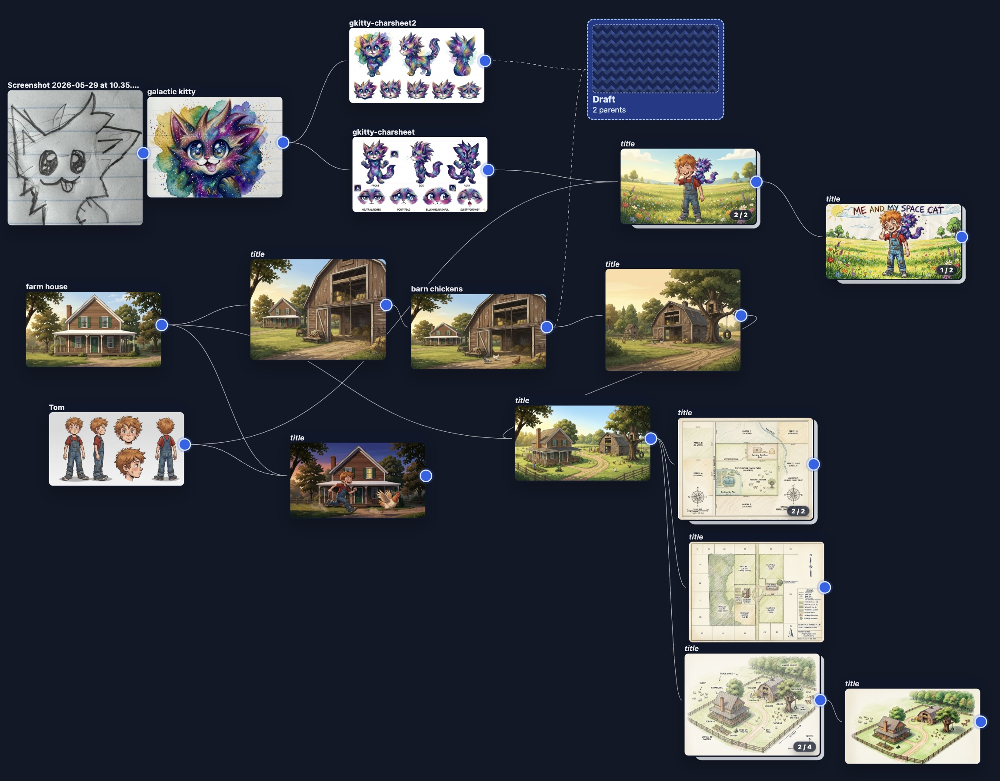

# Comic Canvas

Build comic books with AI assistance: an image-generation canvas with
parent → child lineage, a story/panel layout editor with booklet PDF export,
and narrow **pi agent** tasks that extract characters, locations, and concept
art from a source book.



## Install (macOS arm64, Linux x86_64)

```bash
curl -fsSL https://raw.githubusercontent.com/PlebeiusGaragicus/picture-web/main/install.sh | bash
```

Then launch:

```bash
comic-canvas
```

This starts a local server on `127.0.0.1` and opens the app in your default
browser. `Ctrl-C` in the terminal stops it.

| Command | Purpose |
|---|---|
| `comic-canvas` | Start the app and open the browser |
| `comic-canvas open` | Re-open the browser to a running instance |
| `comic-canvas doctor` | Diagnose pi / node / API-key / server state |
| `comic-canvas logs --tail` | Follow the server log |
| `comic-canvas update` | Upgrade to the latest release (see warning below) |
| `comic-canvas uninstall` | Remove the app (never your projects) |

## Prerequisites

- **pi coding agent** on your PATH, plus Node 22+. Comic Canvas deliberately
  drives *your* system pi — your own pi configuration, models (local or API),
  and credentials. The app refuses to start without a working pi
  (`COMIC_CANVAS_SKIP_PI_CHECK=1` bypasses this; agent features then fail
  with clear errors).
- **Image generation:** a Google AI Studio key, pasted into the in-app
  Settings (gear icon). Stored in `~/.comic-canvas/config.json` (chmod 600);
  the `GOOGLE_API_KEY` env var overrides it. Everything except generation
  works without a key.

## Your data

Everything lives in `~/.comic-canvas/`:

```text
~/.comic-canvas/
  projects/      # your comic projects — back this up like any document folder
  config.json    # API key, auth token, preferences (chmod 600)
  app/           # the installed application (re-downloadable)
  logs/          # server logs
```

!!! warning "Pre-1.0 upgrade warning"
    Releases may change on-disk project schemas without migration. Existing
    projects may stop loading after an upgrade — don't upgrade mid-project
    unless the release notes say it's safe, and back up
    `~/.comic-canvas/projects` first. The installer warns before upgrading.

## Where to go next

- **[User Guide](user-guide.md)** — the workspace views and day-to-day flow.
- **[Architecture](architecture.md)** — system layout, canvas model, the pi
  agent seam, and storage format.
- **[Packaging & Distribution](packaging.md)** — how the desktop packaging
  works and the design decisions behind it.
- **[Pi Agent Methodology](pi-agent-integration.md)** — how pi is embedded as
  an application agent, and why the pattern generalizes.
